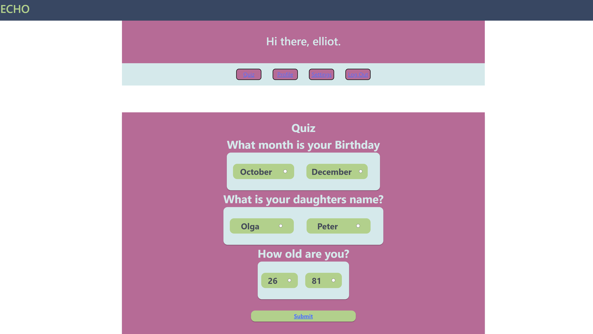
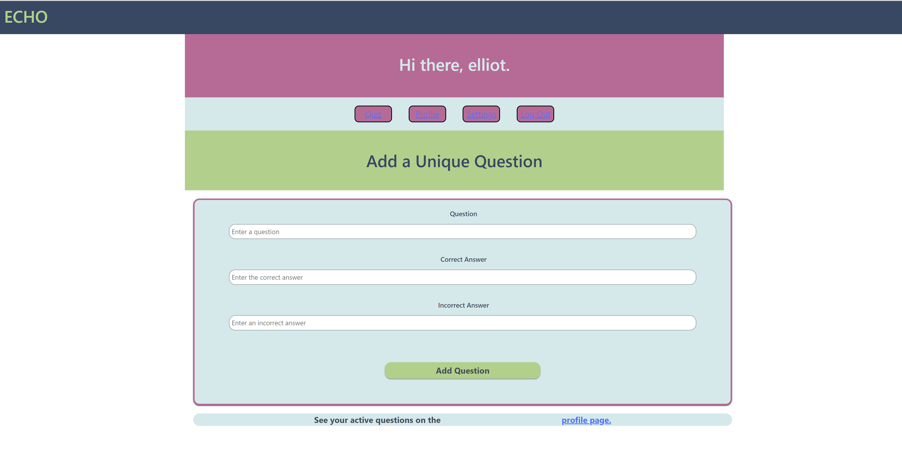

# Echo


### Live URL: https://echo-the-past.herokuapp.com/
### Website Screenshots:




## User Story 
```md
As a CARER / RELATIVE, I want to be able to IDENTIFY if an aged person has signs of memory loss and GAUGE the level of severity,
because I CARE for them.
```

## Description

ECHO IS...
A bespoke tool which aids in the identification of Dementia in it's early stages.
Family and carers can create unique questions to understand the level of support a person might need.

# Table of Contents

- [Installation](#installation)

- [Usage](#usage)

- [License](#license)

- [Applications](#applications)

- [Questions](#questions)


# Installation

This application will need the installation of Node.js and Express.js to create a RESTful API.

npm packages in use for this project

- npm express.js (npm i express)
- npm s ORM (npm i sequelize)
- npm bcrypt (npm i bcrypt)
- npm dotenv (npm install dotenv --save)


# Usage

Steps to use Echo

- When a user visits Echo, they will be taken to the login or signup page where they will have to register an account.
- Once registered, the user can create unique questions, delete them, and take their bespoke quiz.
- Users can also logout when they're done.

# License 

This repository is licensed.


# By Hannah Stampke


# Applications
- HTML
- Mongodb
- Mongoose ODN
- JWT
- React
- GraphQL
- Node.js
- Express.js
- JavaScript
- Styled Components
- Bootstrap


# Questions 
For any questions and comments please reach out to me through email at:
- hannah.stampke@gmail.com


# Links
To view my other projects visit:
- [Hannah](https://github.com/HannahStampke)

